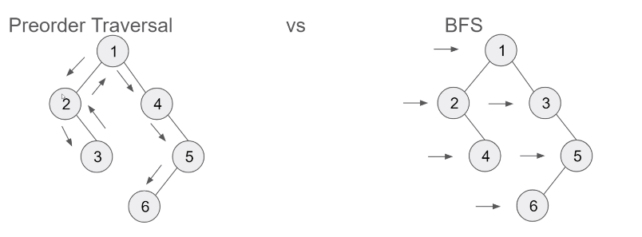
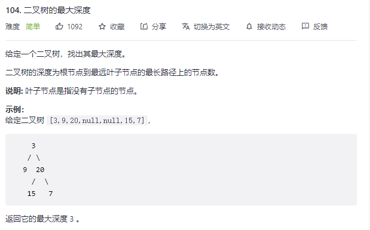

# DFS (Depth-First Search)

DFS(深度优先搜索)是一种递归形式的搜索方式，相对于按层(水平)搜索的BFS而言，DFS更偏向于垂直的概念

 

DFS模板:

1. Base Case
    DoSomething()
    Recurse for subproblems
    

经典的前序、中序、后序遍历的递归方式：
```c++
    void preorder(TreeNode *root) {
        if (root == nullptr) {
            return;
        }
        std::cout<<root->val<<std::endl;
        preorder(root->left, res);
        preorder(root->right, res);
    }

    void inorder(TreeNode *root, vector<int> &res) {
        if (root == nullptr) {
            return;
        }
        inorder(root->left, res);
        std::cout<<root->val<<std::endl;
        inorder(root->right, res);
    }


    void postorder(TreeNode *root, vector<int> &res) {
        if (root == nullptr) {
            return;
        }
        
        postorder(root->left, res);
        postorder(root->right, res);
        std::cout<<root->val<<std::endl;
    }

    vector<int> preorderTraversal(TreeNode *root) {
        vector<int> res;
        preorder(root, res);
        return res;
    }
};

```

## Top Down Vs Bottom Up

Top Down DFS

* 把值通过参数的形式从上往下传
* 一般dfs()本身不返回值

Bottom Up DFS

* 把值从下往上传
* 当前递归层利用subproblem传上来的值计算当前层的新值并返回
* 一定会有返回值

General Steps:
1. Base Case
2. 向子问题要答案(return value)
3. 利用子问题的答案构建当前问题(当前递归层)的答案
4. 若有必要，做一些额外操作
5. 返回答案(给父问题)

递归的问题，<font color='red'>**找中间状态来构建思维逻辑**</font>

## 实践应用


### 104 二叉树的最大深度

  

以下为解题代码：
```
class Solution {
public:
    int maxDepth(TreeNode* root) {
        if(root==nullptr){
            return 0;
        }

        int left=maxDepth(root->left);
        int right=maxDepth(root->right);
        int max_depth=max(left,right)+1;

        return max_depth;
    }
};
```

