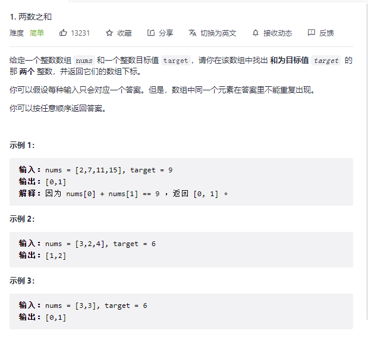
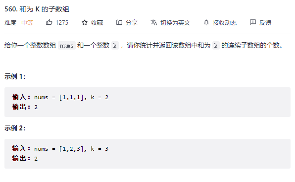

# 哈希表 HashMap

unordered_map和map
* unordered_map存储机制是哈希表，，即unordered_map内部元素是无序的。
* map是以RB-tree为底层机制，map中的元素是按照二叉搜索树存储，进行中序遍历会得到有序遍历。

unordered_set和set
* unordered_set基于哈希表，是无序的。
* set是以RB-tree为底层机制，set的操作几乎都是转调用RB-tree的函数而已。
   * 插入元素时，它会自动调整二叉树的排列，把元素放到适当的位置，以保证每个子树根节点键值大于左子树所有节点的键值，小于右子树所有节点的键值；另外，还得保证根节点左子树的高度与右子树高度相等。

When to use Map

Array 和 Map的区别在于

1. Array无法快速查找，Map可以
2. Array里面的元素时有顺序的，Map没有
3. Array的overhead比较小，Map实现比较复杂

## 实践应用

### 例题 1. 两数之和

 

以下为解题代码：

```

```


### 例题 560. 和为 K 的子数组

  

以下为解题代码：
```

```

