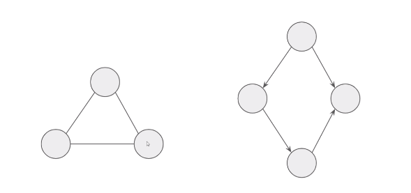
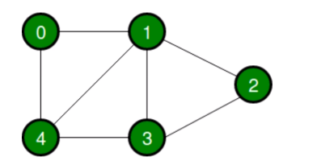
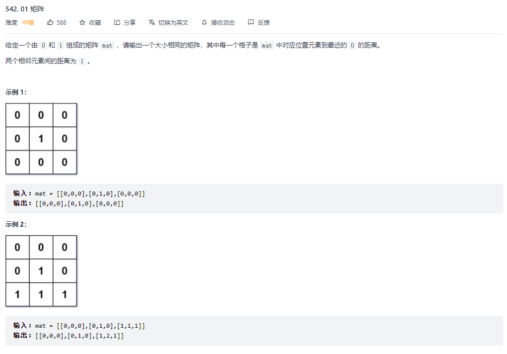
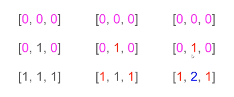
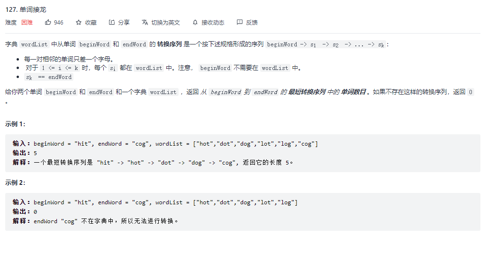
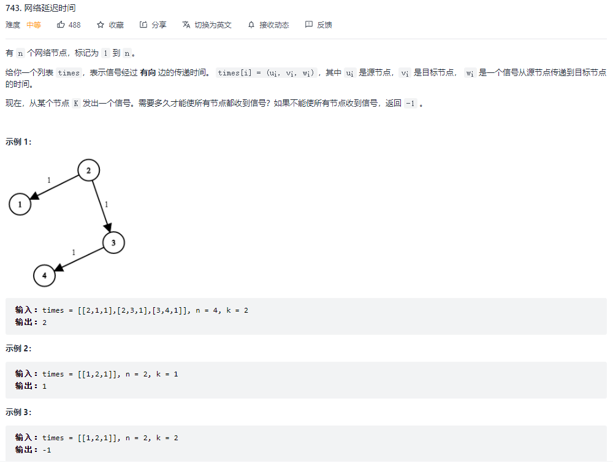
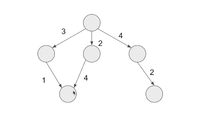
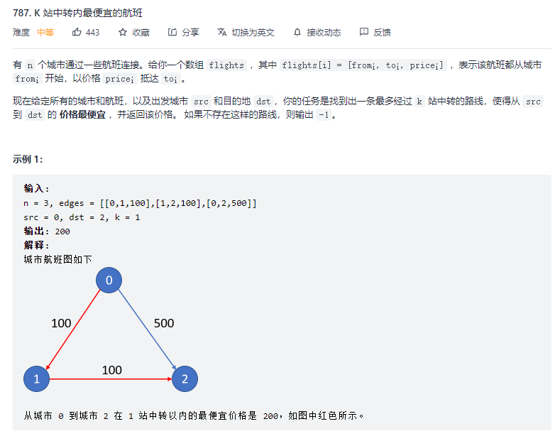
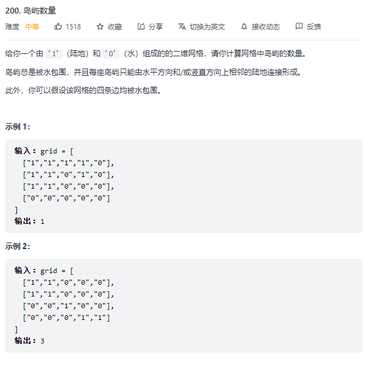

# 图 Graph

## 概念

类似List的概念，内存中不一定连续的数据，由各个节点的Reference组成。

* 可能有环
* 分为无向图和有向图
* 没有固定入口
* 可能有多个入口

 

## Graph Representation

图的存储形式：

* Adjacency Matrix
* Adjacency List

 


图的两种表方法， Adjacency List 就是链表，Adjacency Matrix 就是二维数组。 

### Adjacency List

最常用的2种实现方式(List可用Set代替)

* List<T>[n]
  * adjList[i]:All neighbors of node i
  * Need to know number of nodes(n) beforehand
* Map<T,List<T>>
  * adjList.get(i):All neighbors of node i

## BFS (Breadth-First Search)

以层为概念的搜索方式，因为是水平展开所有nodes，所以<font color='red'>**适合寻找最短路径**</font>。

图可能有环，需要查重。


<font color='red'>**找最短路径只适用于Uniform Cost (每条edge的weight一样)**</font>

## BFS模板

1. Initialize a Queue with all starting points, a HashSet to record visited nodes
2. While queue is not empty
   a. Retrieve current queue size as number of nodes in the current level
   b. For each node in current level
      i. Poll out one node
      ii. If this is the node we want,return it
      iii. Offer all its neighbor to the queue if not visited and vaild
   c. Increase level

小技巧：针对2D Matrix的图，matrix[i] [j] 的neighbors 一般都是上下左右4个，所以预先存4 direction array可以帮助访问

neighbors ——> directions = {{0,1},{1,0},{0,-1},{-1,0}}

Time Complexity O(V+E)


## 实践应用

### 542. 01 矩阵

 

解题思路：

* 正向思维：对于每一个1，利用BFS找到离他最近的0 ——> O(mn * mn)
* 逆向思维：对于所有的0，利用BFS填充到每一个1的距离 ——>O(mn)



以下为解题代码：

```c++
class Solution {
public:
    vector<vector<int>> updateMatrix(vector<vector<int>>& mat) {
        vector<vector<int>> dir = {{0,1},{1,0},{0,-1},{-1,0}};

        int m=mat.size();
        int n=mat[0].size();
        queue<pair<int,int>> queue;
        vector<vector<int>> visited(m,vector<int>(n,0));
        vector<vector<int>> res(m,vector<int>(n,0));

        for(int i=0;i<m;i++){
            for(int j=0;j<n;j++){
                if( mat[i][j] == 0){
                    queue.push({i,j});
                    visited[i][j]=1;
                }
            }
        }

        int level=0;

        while(!queue.empty()){
            int size=queue.size();

            for(int s=0;s<size;s++){
                pair<int,int> cur=queue.front();
                int i=cur.first;
                int j=cur.second;
                queue.pop();

                if(mat[i][j]==1){
                    res[i][j]=level;
                }

                for(int c=0;c<dir.size();c++){
                    int row=i+ dir[c][0];
                    int col=j+ dir[c][1];
                    if(row>=0 && row<m && col>=0 &&col<n&&!visited[row][col]){
                        queue.push({row,col});
                        visited[row][col]=1;
                    }
                }
            }
            level++;
        }

        return res;
    }
};
```

### 127. 单词接龙

 

解题思路：

以下为解题代码：

```
```

# BFS (Best First Search)

针对Non-uniform cost graph的一种算法，核心思想是优先展开最优的节点。

如何每次快速计算最优——> Heap

最有名的graph中找最短路径的算法又称Dijsktra's Algorithm


## BFS模板

1. Initialize a Heap with all starting points marked with some initial costs, a HashSet to record visited nodes
2. While heap is not empty
   a. Poll out one node
   b. If it has already been expanded(visited), skip it
   c. Otherwise mark the node as visited, update its cost
   d. If this is the destination node,return
   e. For all of its neighbors,offer them in to the heap with current nodes's cost + edge cost

Time : O((V+E)logV   Space : O(V)

## 实践应用

### 743. 网络延迟时间



解题思路：

计算从初始节点到离初始节点最远节点的最短路径，其中利用了小根堆来每次获取路径上的最小值，例如3+1，2+4，最终取4。



解题代码：

```c++
class Solution {
public:
    
    struct cmp
    {
        //重载()运算符 
        bool operator()(const vector<int>& n1, const vector<int>& n2)
        {
            return n1[1] > n2[1];
        }
    };

    int networkDelayTime(vector<vector<int>>& times, int n, int k) {
        map<int,vector<vector<int>>> mp;
        
        for(int i=0;i<times.size();i++){
            if(mp.count(times[i][0])){
                mp[times[i][0]].push_back({times[i][1],times[i][2]});
            }
            else{
                vector<vector<int>> tmp;
                tmp.push_back({times[i][1],times[i][2]});
                mp[times[i][0]]=tmp;
            }
        }
        
        map<int,int> costs;
        priority_queue<vector<int>, vector<vector<int>>, cmp> heap;
        
        heap.push({k,0});
        
        while(!heap.empty()){
            vector<int> cur=heap.top();
            heap.pop();
            
            if(costs.count(cur[0]))
                continue;
            
            costs[cur[0]]=cur[1];
            
            if(mp.count(cur[0])){
                //list<vector<int> mlist=mp[cur[0]];
                for(auto e : mp[cur[0]]){
                    if((costs.count(e[0]))==0){
                        heap.push({e[0],cur[1]+e[1]});
                    }
                }
            }
        }
        
        if(costs.size()!=n)
            return -1;
        int res = 0;
        
        for(map<int,int>::iterator iter=costs.begin();iter!=costs.end();iter++){
            res=max(res,iter->second);
        }

        return res;
    }
};
```

### 787. K 站中转内最便宜的航班

 

解题思路：

以下为解题代码：

```
```

# DFS (Depth-First Search)

## 概念

DFS是类似 垂直概念的搜索，不同于BFS的一层层往外扩展，DFS会一口气扎到最深层再递归回到原点，然后再次一口气扎到另外一条路的最深层，如此往复。


## DFS模板

1. Initialize HashSet to record visited nodes
2. For all entry nodes, call dfs()
   a. Validate current node,if visited or invalid or answer node,return
   b. <font color='red'>Do Something (Pre-order)</font>
   c. For each neigbor node:
      i. Validate current node,if visited or invalid or answer node,don't recurse on it or return answer
      ii. Recurse down on neighbor node ——> dfs(neighbor)
   d. <font color='red'>Do Something (Post-order)</font>

Time: O(N*k)

## 实践应用

### 200. 岛屿数量

 

解题思路：
染色思路，将当前值为1，对应相邻的所有1全部染色成0，然后再去找下一个
以下为解题代码：

```c++
DFS:

class Solution {
private:
    void dfs(vector<vector<char>>& grid, int r, int c) {
        int nr = grid.size();
        int nc = grid[0].size();

        grid[r][c] = '0';
        if (r - 1 >= 0 && grid[r-1][c] == '1') dfs(grid, r - 1, c);
        if (r + 1 < nr && grid[r+1][c] == '1') dfs(grid, r + 1, c);
        if (c - 1 >= 0 && grid[r][c-1] == '1') dfs(grid, r, c - 1);
        if (c + 1 < nc && grid[r][c+1] == '1') dfs(grid, r, c + 1);
    }

public:
    int numIslands(vector<vector<char>>& grid) {
        int nr = grid.size();
        if (!nr) return 0;
        int nc = grid[0].size();

        int num_islands = 0;
        for (int r = 0; r < nr; ++r) {
            for (int c = 0; c < nc; ++c) {
                if (grid[r][c] == '1') {
                    ++num_islands;
                    dfs(grid, r, c);
                }
            }
        }

        return num_islands;
    }
};


BFS:

class Solution {
public:
    int numIslands(vector<vector<char>>& grid) {
        int nr = grid.size();
        if (!nr) return 0;
        int nc = grid[0].size();

        int num_islands = 0;
        for (int r = 0; r < nr; ++r) {
            for (int c = 0; c < nc; ++c) {
                if (grid[r][c] == '1') {
                    ++num_islands;
                    grid[r][c] = '0';
                    queue<pair<int, int>> neighbors;
                    neighbors.push({r, c});
                    while (!neighbors.empty()) {
                        auto rc = neighbors.front();
                        neighbors.pop();
                        int row = rc.first, col = rc.second;
                        if (row - 1 >= 0 && grid[row-1][col] == '1') {
                            neighbors.push({row-1, col});
                            grid[row-1][col] = '0';
                        }
                        if (row + 1 < nr && grid[row+1][col] == '1') {
                            neighbors.push({row+1, col});
                            grid[row+1][col] = '0';
                        }
                        if (col - 1 >= 0 && grid[row][col-1] == '1') {
                            neighbors.push({row, col-1});
                            grid[row][col-1] = '0';
                        }
                        if (col + 1 < nc && grid[row][col+1] == '1') {
                            neighbors.push({row, col+1});
                            grid[row][col+1] = '0';
                        }
                    }
                }
            }
        }

        return num_islands;
    }
};
```

拓扑排序:

[399. 除法求值](https://leetcode-cn.com/problems/evaluate-division/)

解题思路：

我们可以将整个问题建模成一张图：给定图中的一些点（变量），以及某些边的权值（两个变量的比值），试对任意两点（两个变量）求出其路径长（两个变量的比值）。

因此，我们首先需要遍历 equations 数组，找出其中所有不同的字符串，并通过哈希表将每个不同的字符串映射成整数。

在构建完图之后，对于任何一个查询，就可以从起点出发，通过广度优先搜索的方式，不断更新起点与当前点之间的路径长度，直到搜索到终点为止。

```c++
class Solution {
public:
    vector<double> calcEquation(vector<vector<string>>& equations, vector<double>& values, vector<vector<string>>& queries) {
        vector<double> res(queries.size(),-1.0);
        unordered_map<string,vector<pair<string,double>>> mp;
        for(int i=0;i<equations.size();i++){
            string src=equations[i][0];
            string target=equations[i][1];
            double val=values[i];

            if(mp.count(src)){
                (mp[src]).push_back(make_pair(target,val));
            }
            else{
                vector<pair<string,double>> tmp;
                tmp.push_back(make_pair(target,val));
                mp[src]=tmp;
            }

            if(mp.count(target)){
                (mp[target]).push_back(make_pair(src,1/val));
            }
            else{
                vector<pair<string,double>> tmp;
                tmp.push_back(make_pair(src,1/val));
                mp[target]=tmp;
            }
        }

        for(int i=0;i<queries.size();i++){
            string src=queries[i][0];
            string target=queries[i][1];
            unordered_set<string> set;
            dfs(src,target,1,mp,res,i,set);
        }
        return res;
    }

    void dfs(string src,string target,double curSum,unordered_map<string,vector<pair<string,double>>>& mp,vector<double>&res,int index,unordered_set<string> set){
        if (set.count(src))
            return;
        else {
            set.emplace(src);
        }

        if (src == target && mp.count(src)) {
            res[index] = curSum;
            return;
        }

        if (mp.count(src)) {
            for (auto i : mp[src]) {
                dfs(i.first, target, curSum*i.second, mp, res, index, set);
            }
        }
    }
};
```

