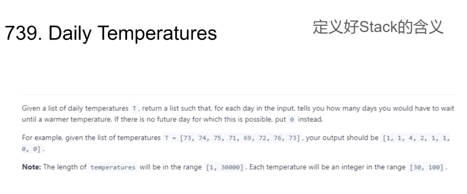
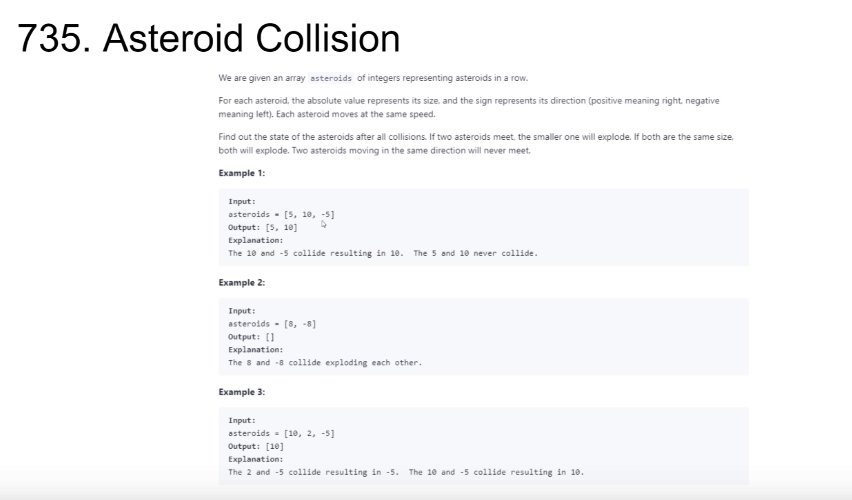

# 栈 Stack

* 特性：LIFO(Last In First Out)
* 适用于需要记录之前的状态，必要时可以回到之前的状态，或利用之前的值
* 不像array, 不能用index访问，只能每次拿栈顶元素

题外话：动态规划 Dynamic Programming

* DP: 记录之前所有状态，随时可能访问任何一个子问题，所以通常用array或HashTable,而且不会回到之前的状态，只会利用之前的值。
* Stack: 每次只需要栈顶元素，并且每个状态只会被用O(1)次。

## Stack Principle

定义好Stack的含义

* 在arr[i]左侧所有比arr[i]大的数
* 递归之前的函数状态

## 实践应用

### 例题 739. Daily Temperatures

 

以下为解题代码：

```java
public int[] dailyTemperatures(int[] T) {
    int n = T.length;
    int[] res = new[n];
    Deque<Interger> stack = new ArrayDeque<>();
    
    for(int i= n - 1 ; i>=0 ; i--){
        while(!stack.isEmpty() && T[i] > T[stack.peek()])
            stack.pop();
        if(stack.isEmpty())
            res[i] = 0;
        else
            res[i] = stack.peek() -i;
        stack.push(i);
    }
    return res;
}
```

### 例题 735. Asteroid Collision

 

以下为解题代码：

```java
class Solution {
    public int[] asteroidCollision(int[] asteroids) {
        Stack<Integer> stack = new Stack();
        for (int ast: asteroids) {
            collision: {
                while (!stack.isEmpty() && ast < 0 && 0 < stack.peek()) {
                    if (stack.peek() < -ast) {
                        stack.pop();
                        continue;
                    } else if (stack.peek() == -ast) {
                        stack.pop();
                    }
                    break collision;
                }
                stack.push(ast);
            }
        }

        int[] ans = new int[stack.size()];
        for (int t = ans.length - 1; t >= 0; --t) {
            ans[t] = stack.pop();
        }
        return ans;
    }
}
```
