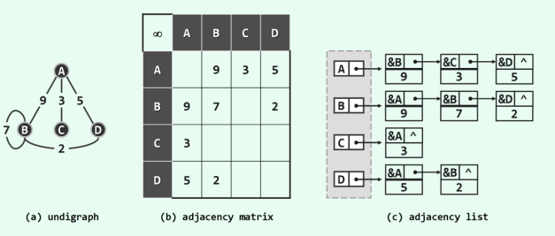
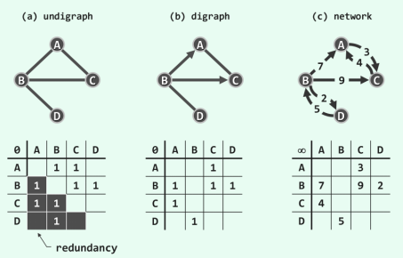

# 数据结构

## 参考资料

[LeetCode 热题 HOT 100](https://leetcode-cn.com/problem-list/2cktkvj/)

[cplusplus数据结构定义](http://www.cplusplus.com/reference/queue/priority_queue/priority_queue/)

[图灵星球刷题套路](https://space.bilibili.com/282739748/channel/seriesdetail?sid=281259)

## 数据结构的存储⽅式

数据结构的存储⽅式只有两种： <font color='red'>**数组（顺序存储） 和链表（链式存储） 。**</font>

对于散列表、 栈、 队列、 堆、 树、 图等等各种数据结构，<font color='red'>**抽象化**</font>后都可以用链表或者数组上的特殊操作来实现，仅API不同而已。

引申STL中的双端队列deque,由其为底层结构可以通过封闭头部开口实现栈stack，封闭头部入口，尾部出口实现queue。

* 队列，栈 这两种数据结构既可以使⽤链表也可以使⽤数组实现。 数组实现， 就要处理扩容缩容的问题；链表实现，没有这个问题，但需要更多的内存空间存储节点指针。

* 图的两种表方法， 邻接表就是链表， 邻接矩阵就是二维数组。 邻接矩阵判断连通性迅速， 并可以进矩阵运算解决些问题， 但是如果图⽐较稀疏的话很耗费空间。 邻接表比较节省空间， 但是很多操作的效率上肯定比不过邻接矩阵。

  * 邻接表

    

  * 邻接矩阵

    

* 散列表。<font color='red'>hashfuntion可以将某一元素映射为一个“大小可接受之索引”，即大数映射成小数</font>。hashtable通过hashfunction将元素映射到不同的位置，但当不同的元素通过hash function映射到相同位置时，便产生了＂碰撞＂问题．
    * 解决碰撞问题的方法主要有<font color='red'>线性探测，二次探测，开链法</font>等．

* 树，因为不一定是完全二叉树， 所以不适合用数组存储。 为此， 在这种链表「树」 结构之上， 又衍生出各种巧妙的设计，例如二叉搜索树、 AVL树、 红黑树、 区间树、 B 树等等， 以应对不同的问题。

    


综上， 数据结构种类很多，甚至可以自定义新的数据结构，但是其底层存储无非是数组或者链表， 两者的优缺点如下：

1. 数组由于是紧凑连续存储，可以随机访问， 通过索引快速找到对应元素，而且相对节约存储空间。

     * 但正因为连续存储， 内存空间必须一次性分配够， 所以说数组如果要扩容， 需要重新分配一块更大的空间，再把数据全部复制过去，时间复杂度 O(N)。

     * 数组中间进行插入或删除，每次必须搬移后面的所有数据以保持连续， 时间复杂度 O(N)。


2. 链表因为元素不连续， 而是靠指针指向下一个元素的位置， 所以不存在数组的扩容问题。
    * 根据某个元素的前驱和后驱， 操作指针即可删除该元素或插入新元素， 时间复杂度 O(1)。
  * 存储空间不连续，无法根据索引算出对应元素的地址，索引不能随机访问；
  * 每个元素必须存储指向前后元素位置的指针， 会消耗相对更多的储存空间。


## 数据结构常用API

### vector

```
声明及初始化
vector<int> vec;
vector<int> vec(5);//声明初始大小为5的int向量
vector<int> vec(10,1);//声明初始大小为10且值都为1的int向量

尾部插入元素: vec.push_back(a)；
尾部删除元素: vec.pop_back()；
使用使用下标访问元素: vec[0]

使用迭代器访问元素:
vector<int>::iterator it;
for(it=vec.begin();it!=vec.end();it++)
    cout<<*it<<endl;

插入元素: vec.insert(vec.begin()+i,a);在第i+1个元素前面插入a;

删除元素: vec.erase(vec.begin()+2);删除第3个元素
vec.erase(vec.begin()+i,vec.end()+j);删除区间[i,j-1];区间从0开始

向量大小:vec.size()
清空:vec.clear();

算法：
#include<algorithm>
1.使用reverse将元素翻转
reverse(vec.begin(),vec.end());将元素翻转，即逆序排列！

2.使用sort排序:
sort(vec.begin(),vec.end());(默认是按升序排列,即从小到大).

可以通过重写排序比较函数按照降序比较，如下：
定义排序比较函数：
static bool Comp(const int &a,const int &b)
{
    return a>b;
}
调用时:sort(vec.begin(),vec.end(),Comp)，这样就降序排序。 

vector<vector<int>> vec(m, vector<int>(n, 0));//初始化一个m行n列的元素值全为0的二维数组
```

### queue

```
定义一个queue的变量: queue<Type> M
查看是否为空范例: empty()
从已有元素后面增加元素: push(x)
输出现有元素的个数: size()
显示第一个元素: front()
显示最后一个元素: back()
弹出队列的第一个元素: pop()
```

### stack

```
返回栈的元素数: size()
返回栈顶的元素: top()
向栈中添加元素x: push(x)
从栈中去除并删除元素: pop()
在栈为空时返回true: empty()
```


### map

```
map遍历
basic
for(iter = str2vec.begin(); iter != str2vec.end(); iter++)
        {output.push_back(iter->second);}   
faster
for(auto& p: str2vec){
  output.push_back(p.second);
}
```

### list

```
list是双向链表，与向量相比，它允许快读的插入和删除，但是随机访问比较慢
Lst1.assign() 给list赋值 
Lst1.back() 返回最后一个元素 
Lst1.begin() 返回指向第一个元素的迭代器 
Lst1.clear() 删除所有元素 
Lst1.empty() 如果list是空的则返回true 
Lst1.end() 返回末尾的迭代器 
Lst1.erase() 删除一个元素 
Lst1.front() 返回第一个元素 
Lst1.get_allocator() 返回list的配置器 
Lst1.insert() 插入一个元素到list中 
Lst1.max_size() 返回list能容纳的最大元素数量 
Lst1.merge() 合并两个list 
Lst1.pop_back() 删除最后一个元素 
Lst1.pop_front() 删除第一个元素 
Lst1.push_back() 在list的末尾添加一个元素 
Lst1.push_front() 在list的头部添加一个元素 
Lst1.rbegin() 返回指向第一个元素的逆向迭代器 
Lst1.remove() 从list删除元素 
Lst1.remove_if() 按指定条件删除元素 
Lst1.rend() 指向list末尾的逆向迭代器 
Lst1.resize() 改变list的大小 
Lst1.reverse() 把list的元素倒转 
Lst1.size() 返回list中的元素个数 
Lst1.sort() 给list排序 
Lst1.splice() 合并两个list 
Lst1.swap() 交换两个list 
Lst1.unique() 删除list中重复的元素
```

### priority_queue

```
q.push()
q.pop()
q.top()
```

### bitset

```
bitset的大小在编译时就需要确定
定义bitset，bitset<16> b;
b.size() 返回位数
b.count() 返回1的个数
b.any() 返回是否有1
b.none() 返回是否没有1
b.set() 全部变成1
b.set(i) 将i+1位变成1
b.set(i,x) 将i+1位变成x
b.reset() 全部都变成0
b.flip() 全部去翻
b.to_string() 转为string类型
```

### unordered_map

```
1.find函数判断某键值是否存在
map.find(key)==map.end() 时不存在
2.count函数
统计key值在map中出现的次数
int count(key)
```

### set

```
1. begin()--返回指向第一个元素的迭代器
2. clear()--清除所有元素
3. count()--返回某个值元素的个数
4. empty()--如果集合为空，返回true
5. end()--返回指向最后一个元素的迭代器
6. equal_range()--返回集合中与给定值相等的上下限的两个迭代器
7. erase()--删除集合中的元素
8. find()--返回一个指向被查找到元素的迭代器
9. get_allocator()--返回集合的分配器
10. insert()--在集合中插入元素
11. lower_bound()--返回指向大于（或等于）某值的第一个元素的迭代器
12. key_comp()--返回一个用于元素间值比较的函数
13. max_size()--返回集合能容纳的元素的最大限值
14. rbegin()--返回指向集合中最后一个元素的反向迭代器
15. rend()--返回指向集合中第一个元素的反向迭代器
16. size()--集合中元素的数目
17. swap()--交换两个集合变量
18. upper_bound()--返回大于某个值元素的迭代器
19. value_comp()--返回一个用于比较元素间的值的函数

unordered_set

1. empty() -- 检查是否为空
2. insert()--插入元素
3. erase()-- 删除指定元素
```

### unordered_set

```
1. empty() -- 检查是否为空
2. insert()--插入元素
3. erase()-- 删除指定元素
```

### string

```
子串：
string substr (size_t pos = 0, size_t len = npos) const;
产生子串
返回一个新建的 初始化为string对象的子串的拷贝string对象。
子串是，在字符位置pos开始，跨越len个字符（或直到字符串的结尾，以先到者为准）对象的部分。
```


