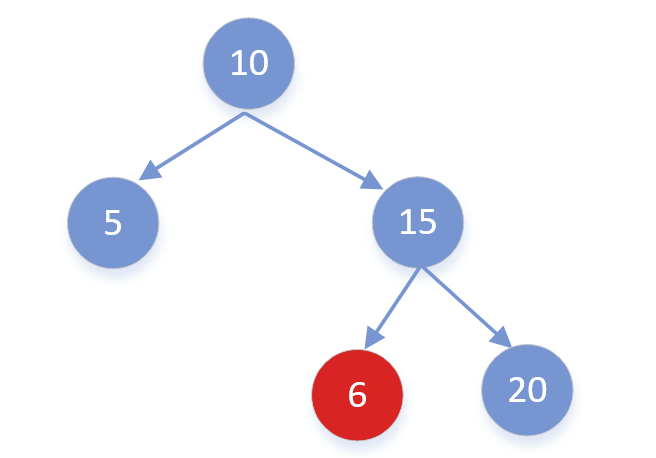

二叉搜索树定义：

```
二叉查找树（Binary Search Tree），它或者是一棵空树，或者是具有下列性质的二叉树： 
1.若它的左子树不空，则左子树上所有结点的值均小于它的根结点的值； 
2.若它的右子树不空，则右子树上所有结点的值均大于它的根结点的值； 
3.它的左、右子树也分别为二叉排序树。
```

注意点：需要考虑每个节点的上限和下限，例如**下述6的上下限为【10，15】**


