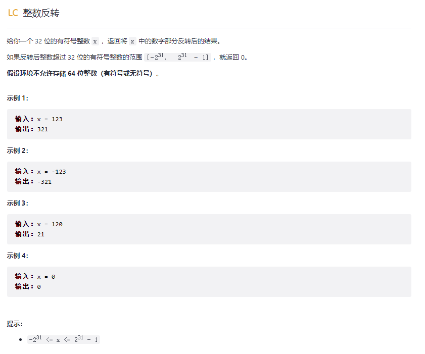
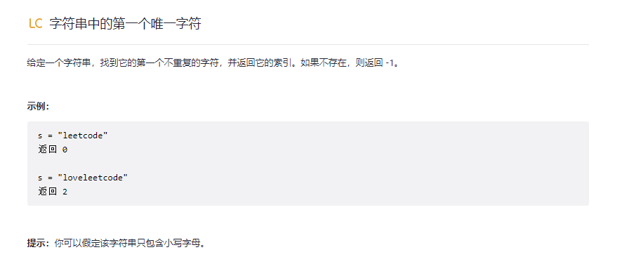

题解：

```c
int reverse(int x)
{
    int res = 0;
    while (x)
    {
        int t = x % 10;
        // int newRes = res * 10 + t; C++ 这样写 res * 10 这里可能就溢出错误了
        // if ((newRes - t) / 10 != res) return 0;
        // res = newRes;
        if (res > INT_MAX / 10 || res < INT_MIN / 10)
            return 0;
        res = res * 10 + t;
        x /= 10;
    }
    return res;
}


if (res > (pow(2,31) - 1) / 10 || res < -pow(2,31) / 10)
   return 0;
```

技巧:INT_MAX和INT_MIN，或者用pow(2,31) - 1和 -pow(2,31)表示。



题解：

```c++
int firstUniqChar(string s)
{
    //vector<int> vec(26,0);
    int vec[26] = {0};

    int size = s.size();
    for (int i = 0; i < size; i++)
    {
        vec[s[i] - 'a']++;//vec[s[i] - 97]++;
    }

    for (int i = 0; i < size; i++)
    {
        if (vec[s[i] - 'a'] == 1)
            return i;
    }

    return -1;
}
```

技巧:注意vector和a[]数组初始化，同时记住小写a对应数值为97，大写A对应字符为65，两者之差为32。

判断回文串：

```c++
bool isPalinderome(string str){
        int left=0;
        int right=str.size()-1;

        while(left<right){
            if(str[left++]!=str[right--]){
                return false;
            }
        }
        return true;
    }
```

全排列：

```c++
vector<vector<int>> permute(vector<int>& nums) {
        vector<vector<int>> res;

        if(nums.size()==0){
            return res;
        }

        int size=nums.size();
        int depth=0;
        vector<bool> isUsed(size,false);
        vector<int> tmpRes;

        for(int i=0;i<size();i++){
            if(isUsed[i]){
                continue;
            }
            isUsed[i] =true;
            tmp.push_back(nums[i]);
            dfs(nums,depth+1,isUsed,tmpRes,res)
            isUsed[i] =false;
            tmp.pop_back();
        }

        return res;
    }

    void dfs(vector<int>& nums,int depth,vector<bool> isUsed,vector<int> tmpRes,vector<vector<int>>& res){
        if(depth==nums.size()){
            res.push_back(tmpRes);
        }
    }
```

可以采用广度优先遍历和深度优先遍历
