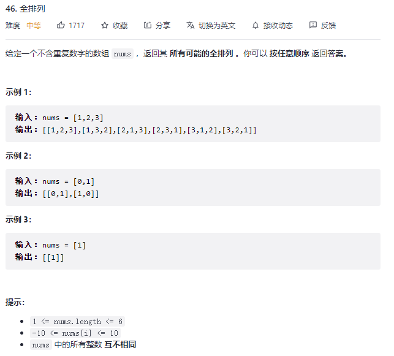
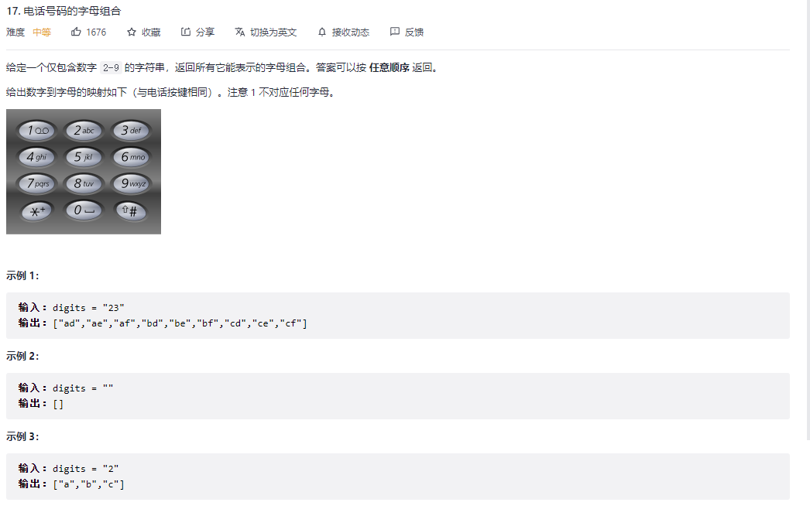
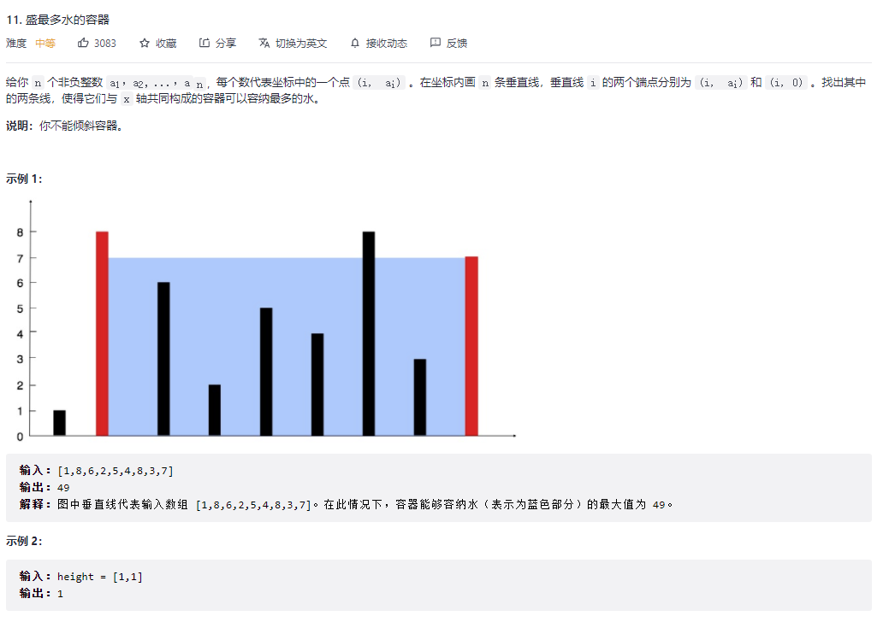

## 全排列



题解：

```c
class Solution {
public:
    vector<vector<int>> permute(vector<int>& nums) {
        vector<vector<int>> res;

        if(nums.size()==0){
            return res;
        }

        int size=nums.size();
        int depth=0;
        vector<bool> isUsed(size,false);
        vector<int> tmpRes;

        dfs(nums,size,depth,isUsed,tmpRes,res);

        return res;
    }

    void dfs(vector<int>& nums,int size,int depth,vector<bool> isUsed,vector<int> tmpRes,vector<vector<int>>& res){
        if(depth==size){
            res.push_back(tmpRes);
        }

        for(int i=0;i<size;i++){
            if(isUsed[i]){
                continue;
            }
            isUsed[i] =true;
            tmpRes.push_back(nums[i]);
            dfs(nums,size,depth+1,isUsed,tmpRes,res);
            isUsed[i] =false;
            tmpRes.pop_back();
        }
    }
};
```



```c++
class Solution {
public:
    string tmp;
    vector<string> res;
    vector<string> board={"","","abc","def","ghi","jkl","mno","pqrs","tuv","wxyz"};
    void DFS(int pos,string digits){
        if(pos==digits.size()){
            res.push_back(tmp);
            return;
        }
        int num=digits[pos]-'0';
        for(int i=0;i<board[num].size();i++){
            tmp.push_back(board[num][i]);
            DFS(pos+1,digits);
            tmp.pop_back();
        }
    }
    vector<string> letterCombinations(string digits) {
        if(digits.size()==0) return res;
        DFS(0,digits);
        return res;
    }
};
```

技巧:可以采用广度优先遍历和深度优先遍历

## 盛最多水的容器



采用双指针解法：每次移动短边。

```c++
class Solution {
public:
    int maxArea(vector<int>& height) {
        int maxArea=-1;
        int size=height.size();
        int left=0;
        int right=size-1;

        while(left<right){
            if(height[left]<height[right]){
                maxArea=max(maxArea,height[left]*(right-left));
                left++;
            }
            else {
                maxArea=max(maxArea,height[right]*(right-left));
                right--;
            }
        }

        return maxArea;

    }
};
```

198. 打家劫舍
```c++
class Solution {
public:
    int maxSum=0;
    int rob(vector<int>& nums) {
        int size=nums.size();
        int curSum=0;
        backtrack(0,size,nums,curSum);

        return maxSum;
    }

    void backtrack(int pos,int size,vector<int>& nums,int curSum){
        if(pos>=size){
            maxSum =max(maxSum,curSum);
        }

        for(int i=pos;i<size;i++){
            backtrack(i+2,size,nums,curSum + nums[i]);
            backtrack(i+1,size,nums,curSum);
        }

    }
};
```

215. 数组中的第K个最大元素

```c++
class Solution {
public:
    int findKthLargest(vector<int>& nums, int k) {
        priority_queue<int> queue;

        for(int i=0;i<nums.size();i++){
            queue.emplace(nums[i]);
        }

        for(int i=0;i<=k-1;i++){
            if(i==k-1)
                return queue.top();
            queue.pop();
        }
        return 0;
    }
};
```

238. 除自身以外数组的乘积

注意边界
```c++
class Solution {
public:
    vector<int> productExceptSelf(vector<int>& nums) {
        int size=nums.size();
        int left=0,right=size-1;

        int leftSum=1;
        int rightSum=1;

        vector<int> afterVec(size,1);
        vector<int> preVec(size,1);
    

        for(int i=right;i>0;i--){
            rightSum=rightSum*nums[i];
            afterVec[i]=rightSum;
        }

        for(int i=0;i<right;i++){
            leftSum=leftSum*nums[i];
            preVec[i]=leftSum;
        }

        for(int i=0;i<=right;i++){
            if(i-1>=0&&i+1<=right)
                nums[i]=preVec[i-1]*afterVec[i+1];
            else if(i==0){
                nums[i]=afterVec[i+1];
            }
            else if(i==right){
                nums[i]=preVec[i-1];
            }
        }

        return nums;
    }
};
```

347. 前 K 个高频元素

```c++
class Solution {
public:

    static bool cmp_by_value(const pair<int,int> & lhs, const pair<int,int> & rhs) {
        return lhs.second > rhs.second;
    }

    vector<int> topKFrequent(vector<int>& nums, int k) {
            map<int,int> mp;
            vector<int> res;

            for(int i=0;i<nums.size();i++){
                if(mp.count(nums[i])){
                    mp[nums[i]]++;
                }
                else{
                    mp[nums[i]]=1;
                }
            }

            vector<pair<int,int>> tmp;

            for(map<int,int>::iterator iter=mp.begin();iter!=mp.end();iter++){
                tmp.push_back({iter->first,iter->second});
            }

            sort(tmp.begin(),tmp.end(),cmp_by_value);

            for(int i=0;i<tmp.size()&&k>0;i++,k--){
                res.push_back(tmp[i].first);
            }
            
            return res;
    }
};
```

494. 目标和

```c++
class Solution {
public:
    int res=0;
    int findTargetSumWays(vector<int>& nums, int target) { 
        backtrack(nums,target,0,0);
        return res;
    }

    void backtrack(vector<int>& nums, int target, int pos,int cur){
        if(pos==nums.size()){
            if(cur==target)
                res++; 
            return;
        }

        backtrack(nums,target,pos+1,cur-nums[pos]);
        backtrack(nums,target,pos+1,cur+nums[pos]);
    }
};
```

239. 滑动窗口最大值

```c++
class Solution {
public:
    vector<int> maxSlidingWindow(vector<int>& nums, int k) {
        priority_queue<pair<int,int>> heap;
        vector<int> res;
        int left=0;

        for(int i=0;i<k;i++){
            heap.push({nums[i],i});
        } 

        res.push_back((heap.top()).first);

        for(int i=k;i<nums.size();i++){
            heap.push({nums[i],i});
            
            while(heap.top().second<=i-k){
                heap.pop();
            }

            res.push_back(heap.top().first);
        } 
        return res;
    }
};
```

[240. 搜索二维矩阵 II](https://leetcode-cn.com/problems/search-a-2d-matrix-ii/)

```c++
class Solution {
public:
    bool searchMatrix(vector<vector<int>>& matrix, int target) {
        int m=matrix.size();
        int n=matrix[0].size();

        for(int i=0;i<m;i++){
            if(target>matrix[i][n-1] || target<matrix[i][0]){
                continue;
            }

            if(binSearch(matrix[i],target)){
                return true;
            }
            
        }

        return false;
    }

    bool binSearch(vector<int>& nums,int target){
        int left=0,right=nums.size()-1;

        while(left<=right){
            int mid=left +(right-left)/2;

            if(nums[mid]==target){
                return true;
            }
            else if(nums[mid]<target){
                left=mid+1;
            }
            else{
                right=mid-1;
            }
        }

        return false;
    }
};

最优解:Z 字形查找
class Solution {
public:
    bool searchMatrix(vector<vector<int>>& matrix, int target) {
        int m=matrix.size();
        int n=matrix[0].size();

        int row=0,col=n-1;

        while(row<m && col>=0){
            if(matrix[row][col]==target)
                return true;
            
            if(matrix[row][col]<target){
                row++;
            }
            else if(matrix[row][col]>target){
               col--;
            }
        }

        return false;
    }

};
```

[84. 柱状图中最大的矩形](https://leetcode-cn.com/problems/largest-rectangle-in-histogram/)

```c++
暴力解:
class Solution {
public:
    int largestRectangleArea(vector<int>& heights) {
        int n = heights.size();
        int ans = 0;
        // 枚举左边界
        for (int left = 0; left < n; ++left) {
            int minHeight = INT_MAX;
            // 枚举右边界
            for (int right = left; right < n; ++right) {
                // 确定高度
                minHeight = min(minHeight, heights[right]);
                // 计算面积
                ans = max(ans, (right - left + 1) * minHeight);
            }
        }
        return ans;
    }
};

单调栈：
class Solution {
public:
    int largestRectangleArea(vector<int>& heights) {
        int len = heights.size();
        if (len == 0) {
            return 0;
        }
        if (len == 1) {
            return heights[0];
        }

        int res = 0;
		stack<int> stack;
        for (int i = 0; i < len; i++) {
            // 这个 while 很关键，因为有可能不止一个柱形的最大宽度可以被计算出来
            while (!stack.empty() && heights[i] < heights[stack.top()]) {
                int curHeight = heights[stack.top()];
				stack.pop();
                while (!stack.empty() && heights[stack.top()] == curHeight) {
                    stack.pop();
                }

                int curWidth;
                if (stack.empty()) {
                    curWidth = i;
                } else {
                    curWidth = i - stack.top() - 1;
                }

                // System.out.println("curIndex = " + curIndex + " " + curHeight * curWidth);
                res = max(res, curHeight * curWidth);
            }
            stack.push(i);
        }

        while (!stack.empty()) {
            int curHeight = heights[stack.top()];
			stack.pop();
            while (!stack.empty() && heights[stack.top()] == curHeight) {
				stack.pop();
            }
            int curWidth;
            if (stack.empty()) {
                curWidth = len;
            } else {
                curWidth = len - stack.top() - 1;
            }
            res = max(res, curHeight * curWidth);
        }
        return res;
    }
};
```

[560. 和为 K 的子数组](https://leetcode-cn.com/problems/subarray-sum-equals-k/)

```c++
class Solution {
public:
    int subarraySum(vector<int>& nums, int k) {
        int count=0;

        for(int i=0;i<nums.size();i++){
            int curSum=0;
            for(int j=i;j<nums.size();j++){
                curSum=curSum+nums[j];
                if(curSum==k)
                    count++;
            }
        }

        return count;
    }
};

前缀和 + 哈希表优化
    
class Solution {
public:
    int subarraySum(vector<int>& nums, int k) {
        int count=0;
        unordered_map<int,int> mp;
        mp[0]=1;

        int preSum=0;
        for(int i=0;i<nums.size();i++){
            preSum+=nums[i];

            if(mp.count(preSum-k)){
                count+=mp[preSum-k];
            }

            mp[preSum]++;
        }

        return count;
    }
};
```

[581. 最短无序连续子数组](https://leetcode-cn.com/problems/shortest-unsorted-continuous-subarray/)

```c++

有些情况不对：
class Solution {
public:
    int findUnsortedSubarray(vector<int>& nums) {
        //查找逆序对
        int begin=-1,end=-1;
        for(int i=0;i<nums.size()-1;i++){
            if(begin==-1&&nums[i]>nums[i+1]){
                begin=i;
                end=i+1;
            }

            if(nums[i]>nums[i+1]){
                end=i+1;
            }
            else if(nums[i]==nums[i+1]){
                if(nums[begin]>nums[i+1]){
                   end=i+1; 
                }
            }
        }

        if(begin==-1){
            return 0;
        }

        return end-begin+1;
    }
};

找出左右两边已经排序的子数组，然后通过size-left-right 计算。
    
class Solution {
public:
    int findUnsortedSubarray(vector<int>& nums) {
        vector<int> tmp=nums;
        int size=nums.size();

        sort(tmp.begin(),tmp.end());

        if(tmp==nums)
            return 0;

        int left=0,right=0;
        for(int i=0;i<size;i++){
            if(tmp[i]!=nums[i]){
                break;
            }
            left++;
        }

        for(int i=size-1;i>=0;i--){
            if(tmp[i]!=nums[i]){
                break;
            }
            right++;
        }

        return size-left-right;
    }
};
```

[416. 分割等和子集](https://leetcode-cn.com/problems/partition-equal-subset-sum/)

```c++
class Solution {
public:
    bool isFind=false;
    bool canPartition(vector<int>& nums) {
        int sum=0;
        for(int i=0;i<nums.size();i++){
            sum+=nums[i];
        }

        if(sum%2==1)
            return false;

        int target=sum/2;

        backtrack(0,0,target,nums);
        return isFind;
    }
    

    void backtrack(int pos,int curSum,int target,vector<int>& nums){
        if(isFind)
            return;

        if(pos==nums.size()){
            isFind=false;
        }
        else{
            if(curSum==target && pos!=0){
                isFind=true;
            }
            backtrack(pos+1,curSum+nums[pos],target,nums);
            backtrack(pos+1,curSum,target,nums);
        }
    }
};

加记忆：
class Solution {
public:
    bool isFind=false;
    map<string,bool> mp;
    bool canPartition(vector<int>& nums) {
        int sum=0;
        for(int i=0;i<nums.size();i++){
            sum+=nums[i];
        }

        if(sum%2==1)
            return false;

        int target=sum/2;

        backtrack(0,0,target,nums);
        return isFind;
    }
    

    void backtrack(int pos,int curSum,int target,vector<int>& nums){
        if(isFind)
            return;

        if(pos==nums.size()){
            isFind=false;
        }
        else{
            if(curSum==target && pos!=0){
                isFind=true;
            }
            string key=std::to_string(pos)+"&"+std::to_string(curSum);
            if(mp.count(key)){
                isFind=mp[key]; 
            }
            else{
                backtrack(pos+1,curSum+nums[pos],target,nums);
                backtrack(pos+1,curSum,target,nums);
                mp[key]=isFind; 
            }
        }
    }
};
```

