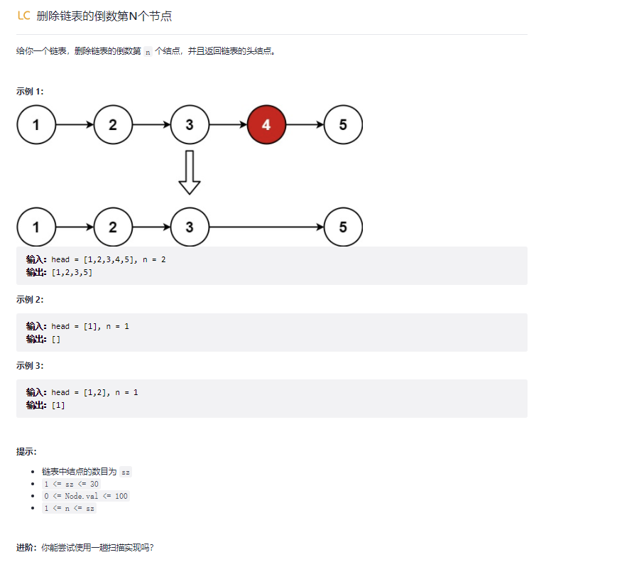
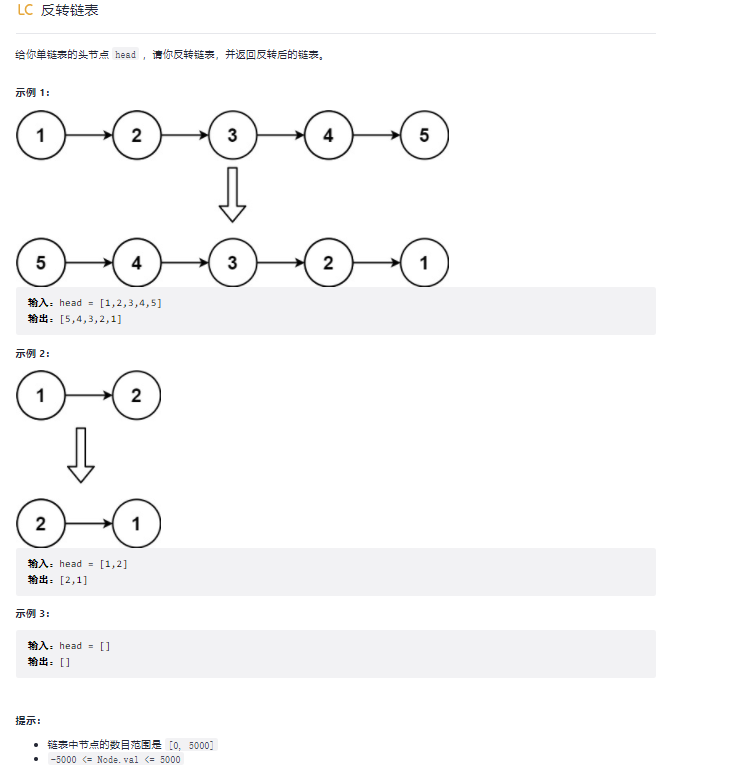

前提：

```c
/**
 * Definition for singly-linked list.
 * struct ListNode {
 *     int val;
 *     ListNode *next;
 *     ListNode() : val(0), next(nullptr) {}
 *     ListNode(int x) : val(x), next(nullptr) {}
 *     ListNode(int x, ListNode *next) : val(x), next(next) {}
 * };
 */
```

**删除链表的倒数第N个节点**



题解：

```c
方法一:
首先遍历一遍计算出list长度len，然后找到len-n的前一个节点，改变其指向，需要注意head节点特殊处理

ListNode *removeNthFromEnd(ListNode *head, int n)
{
    int len = length(head);
    int step = len - n;

    if (step == 0)
    {
        return head->next;
    }

    ListNode *tmp1 = head;
    for (int i = 1; i < step; i++)
    {
        tmp1 = tmp1->next;
    }
    tmp1->next = tmp1->next->next;

    return head;
}

int length(ListNode *node)
{
    int size = 0;

    while (node)
    {
        size++;
        node = node->next;
    }

    return size;
}

方法二:
快慢指针，且增加一个头节点的方法

ListNode *removeNthFromEnd(ListNode *head, int n)
{
    ListNode *res = new ListNode(0, head);
    ListNode *fast = res;
    ListNode *slow = res;

    for (int i = 1; i <= n; i++)
    {
        fast = fast->next; //走n步
    }

    while (fast->next)
    {
        fast = fast->next; //走到结尾
        slow = slow->next; //走了len-n步
    }
    slow->next = slow->next->next;
    return res->next;
}
```

技巧: 快慢指针，增加一个头节点。

**反转链表**



```c++
ListNode *reverseList(ListNode *head)
{
    ListNode *end = nullptr;

    if (head == nullptr || head->next == nullptr)
    {
        return head;
    }

    while (head->next)
    {
        ListNode *tmp = head->next;
        head->next = end;
        end = head;
        head = tmp;
    }

    head->next = end;

    return head;
}
```

更好的解法:

```c++
ListNode *reverseList(ListNode *head)
{
    ListNode *prev = nullptr;
    ListNode *curr = head;
    while (curr)
    {
        ListNode *next = curr->next;
        curr->next = prev;
        prev = curr;
        curr = next;
    }
    return prev;
}
```

技巧：可以尝试去判断头节点是否为空
